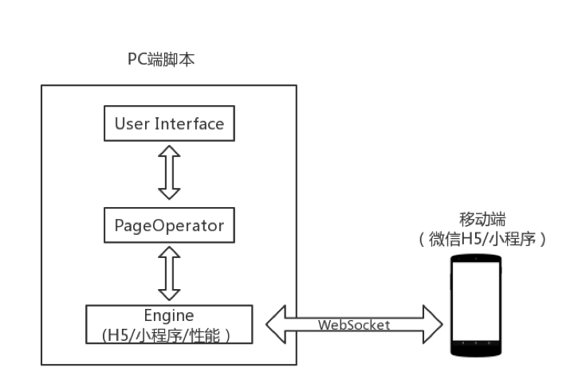
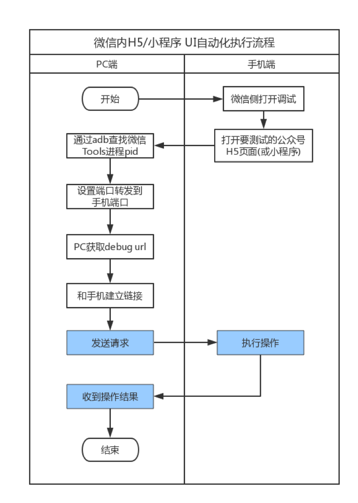

# fastAutoTest4nodejs

> 一个H5,小程序自动化测试框架

## 简介

此测试框架以腾讯官方的FAutoTest测试框架为基础，用nodejs进行了重写，对具体的实现方式进行了优化，速度更快。在支持原有api的基础上，添加了Selenium风格的api，支持更多功能。后续计划推出更多功能。

随着产品业务形态逐渐从 App 延升到微信小程序、微信公众号以及 QQ公众号等，而之前的自动化建设主要是 Native App 为主，全手工测试已无法满足快速增长的业务需求。为提升测试效率和质量，FAutoTest 框架致力于解决 QQ、微信内 UI 的自动化问题（包括微信内 H5页面和小程序、QQ 内 H5页面），提升自动化测试的效率和稳定性。

FAutoTest 是一款成长中的框架，吸收借鉴了一些 UI 自动化工具的优秀设计理念和思想。如果框架有不足地方，或者你有更好的建议，欢迎提交 Issues 参与贡献。

### 特性

FAutoTest 专业服务于微信 H5/小程序的UI自动化测试，提升测试效率与质量。

* 支持微信 H5页面，能识别常见 H5控件，能获取页面任意内容（常见的如文字、图片、链接等）
* 支持小程序内控件识别，操作，页面内容获取等
* 支持安卓 Native 页面组合操作使用
* 简单的 API 设计，较低的使用门槛
* 支持基础的性能测试监控
* 功能扩展性强，扩展门槛低

### 架构 

1. 整体采用分层设计，API设计方式参考 WebDriver 

2. 整体框架是一个同步阻塞的模型：在一个线程中循环的执行 receive 方法，等待收到 response，发送消息后，阻塞，只有当 receive 方法获得消息时，才会解除阻塞，发送下一条消息，具备超时异常处理机制

3. 框架内打包了 Python 版本的 UIAutomator，方便在安卓 Native 页面进行操作

  

   **User Interface(用户交互层)：** 提供给用户所有的界面操作 API(H5界面及小程序界面)，使用者不需要关注框架内部实现，只需要关注自身业务逻辑流程（手工用例流程转换成自动化流程）

   **PageOperator(操作解析层)：** 主要用于接收和解析用户命令后传递给下层 Engine 层

   **Engine( H5&小程序引擎层)：** 将用户命令传输到手机，并返回结果信息。封装 WebSocket 和单线程池，通过WebSocket Debug URL 和浏览器内核建立链接，发送 Json 格式的协议到手机端进行用户指定的操作。

### 业务流程

* H5页面/小程序 UI 自动化执行流程
  

* 自动化脚本调用流程
  
  

## 依赖软件环境

| 软件               | 软件要求                |
| ------------------ | ----------------------- |
| node 版本         | 8.11.x 以上版本              |
| Java JDK 版本       | Java 语言框架（最低1.7） |
| Android SDK 版本    | 4.4 及以上版本           |
| adb 版本            | 最新版本即可            |
        |


#### 1. Java JDK 版本安装

下载 & 安装 [Java JDK](http://www.oracle.com/technetwork/java/javase/downloads/index.html) 安装后在终端输入命令`java -version`，`java`, `javac`命令能够执行，则 Java 环境配置成功。


#### 2. Android SDK 版本安装

下载 & 安装 [Android Studio](https://developer.android.com/studio/)，然后在里面安装 `Android SDK`

#### 3. 配置 adb 环境

安装 Android Studio 后，配置 SDK 环境（若自动安装不成功，可到[手动下载安装](http://developer.android.com/sdk/index.html) ，安装后在终端输入命令 `adb version` 执行有结果，则说明配置成功

## FAutoTest 开发环境安装 


* 安装自身框架

  ```
  npm install fastAutoTest4nodejs
  ```

* 打开微信Debug模式，安装 TBS 内核
  * 可在微信中打开 X5 调试地址：[http://debugx5.qq.com](http://debugx5.qq.com)
  * TBS 内核安装地址：[http://debugtbs.qq.com](http://debugtbs.qq.com)
  * 详情方式见：[http://x5.tencent.com/tbs/guide/debug/faq.html](http://x5.tencent.com/tbs/guide/debug/faq.html)

## 使用方式

如何写测试案例，如微信 H5页面，如下所示：

```javascript
const {WebviewDriver}=require('./index');

function mytarget(targets){
    const pid=targets.findIndex(function(value,index){
        if(value.title==="腾讯医典"){
            return true;
        }
    });
    return pid;
}


async function example() {
    const wxDriver=new WebviewDriver();
    await wxDriver.initDriver({target:mytarget});

    const liuxingxi='//*[@id="js_content"]/section/section/section/section[2]/p[91]/span/a';

    try{

        const a=await wxDriver.clickElementByXpath(liuxingxi);
        await WebviewDriver.sleep(5000);

    }catch (err) {
        throw err
    }finally {
        await wxDriver.closeClient();
    }
}
example();

```

1. 从微信初始化 H5页面，如进入 [http://h5.baike.qq.com/mobile/enter.html](http://h5.baike.qq.com/mobile/enter.html)
2. 进入页面后找到需要操作的控件的`xpath`，可通过 `chrome:inspect` 找到当前页面，找到控件的`xpath`
3. 初始化框架并进行 API 调用，如执行点击控件等
4. 关闭框架，执行用例


